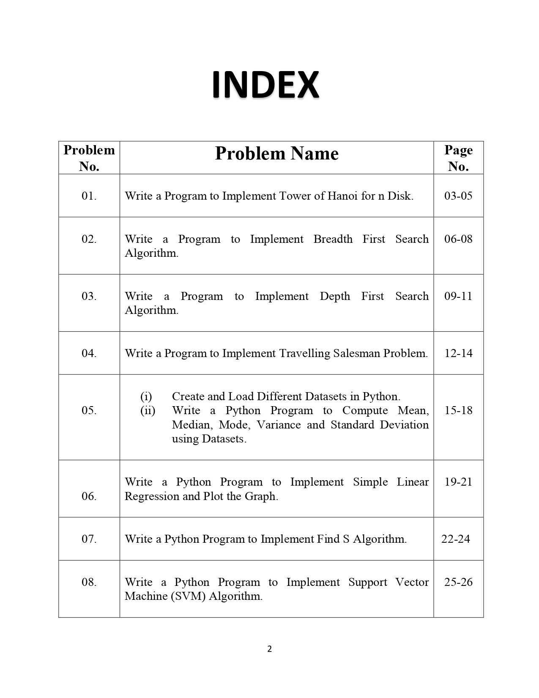

#  ARTIFICIAL-INTELLIGENCE (AI)

[![Youtube][youtube-shield]][youtube-url]
[![Facebook][facebook-shield]][facebook-url]
[![Instagram][instagram-shield]][instagram-url]
[![LinkedIn][linkedin-shield]][linkedin-url]

Thanks for visiting my GitHub account!

 **Artificial intelligence (AI)**, the ability of a digital computer or computer-controlled robot to perform tasks commonly associated with intelligent beings. The term is frequently applied to the project of developing systems endowed with the intellectual processes characteristic of humans, such as the ability to reason, discover meaning, generalize, or learn from past experience. [see-more](https://www.britannica.com/technology/artificial-intelligence)

### [Code-Example](https://github.com/learnwithfair/machine-lerning)

## Source Code (Download)

[Click Here](https://mega.nz/folder/tL00VSoQ#E4snCVQ3MAKOd-Nss7sWEA)

## Required Software (Download)

- Python, Download ->https://www.python.org/downloads/
- Jupyter Notebook, Download -> pip install jupyter
- Code::Blocks, Download(mingw-setup.exe, FossHUB) ->https://www.codeblocks.org/downloads/binaries/
- Or, [Click-here](https://www.fosshub.com/Code-Blocks.html?dwl=codeblocks-20.03mingw-setup.exe)

### Downloading Process

1. For Jupyter

   - Set up the environment variable in the upper section

   ```url
       C:\Users\MD RAHATUL RABBI\AppData\Local\Programs\Python\Python312\Scripts\
       C:\Users\MD RAHATUL RABBI\AppData\Local\Programs\Python\Python312\
       C:\Users\MD RAHATUL RABBI\AppData\Local\Programs\Python\Launcher\ (Optional)
   ```

   - Run the command in cmd `pip install jupyter`
   - For open project run the command in cmd `jupyter notebook`

2. For Codeblocks
   - Select codeblocks-20.03mingw-setup.exe
   - Click on FossHUB

## Project Features

|                              |
| :--------------------------: |
|  |

## Follow Me

[](https://github.com/learnwithfair) [](https://www.facebook.com/learnwithfair/) [](https://www.instagram.com/learnwithfair/) [](https://www.twiter.com/learnwithfair/) [](https://www.youtube.com/@learnwithfair)

<!-- MARKDOWN LINKS & IMAGES -->

[youtube-shield]: https://img.shields.io/badge/-Youtube-black.svg?style=flat-square&logo=youtube&color=555&logoColor=white
[youtube-url]: https://youtube.com/@learnwithfair
[facebook-shield]: https://img.shields.io/badge/-Facebook-black.svg?style=flat-square&logo=facebook&color=555&logoColor=white
[facebook-url]: https://facebook.com/learnwithfair
[instagram-shield]: https://img.shields.io/badge/-Instagram-black.svg?style=flat-square&logo=instagram&color=555&logoColor=white
[instagram-url]: https://instagram.com/learnwithfair
[linkedin-shield]: https://img.shields.io/badge/-LinkedIn-black.svg?style=flat-square&logo=linkedin&colorB=555
[linkedin-url]: https://linkedin.com/company/learnwithfair
